## 网络编程流程

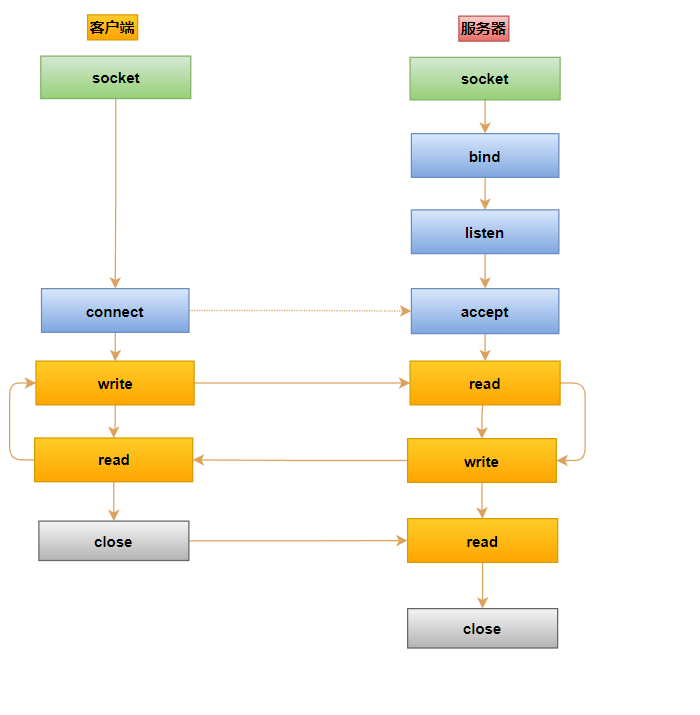

## 堵塞IO

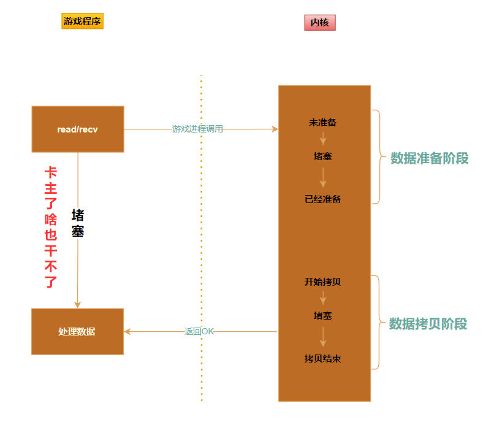

## 非堵塞IO

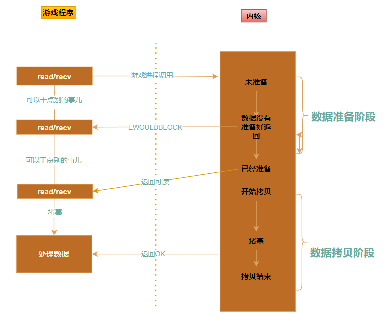

## 信号驱动IO

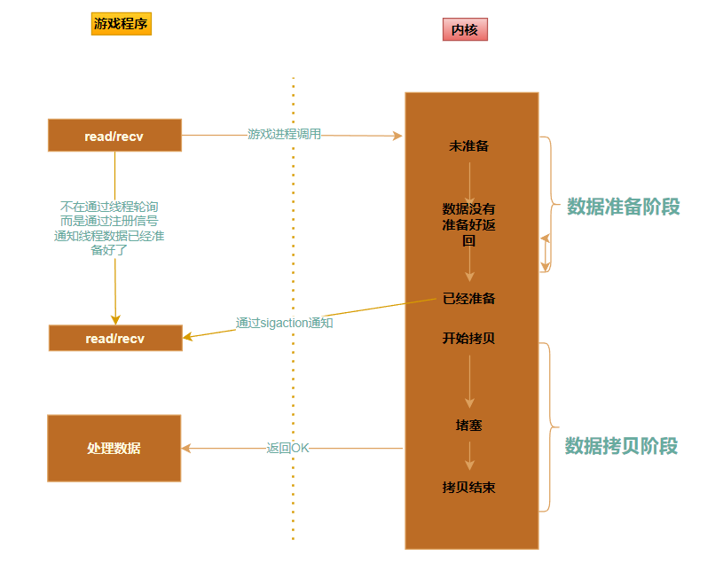

## 异步io模型

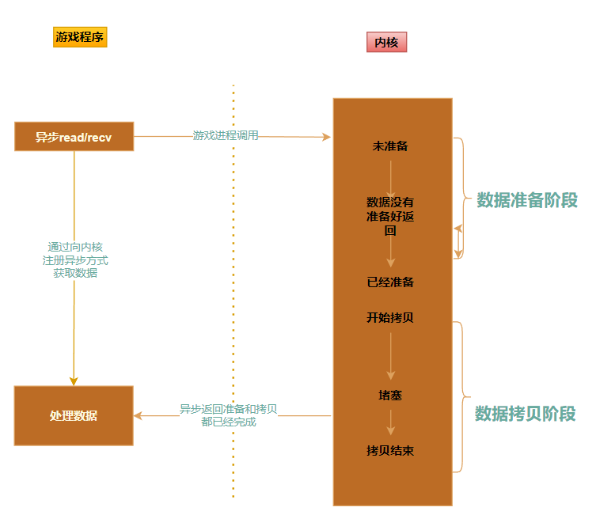

## 多路复用

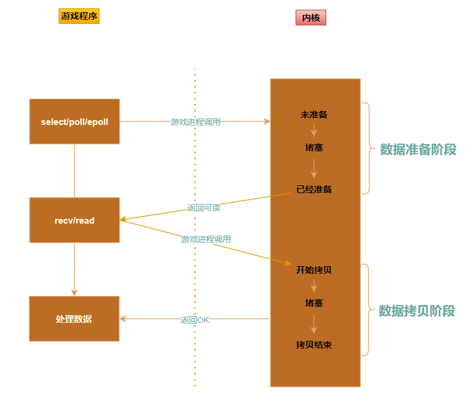

## 单reactor

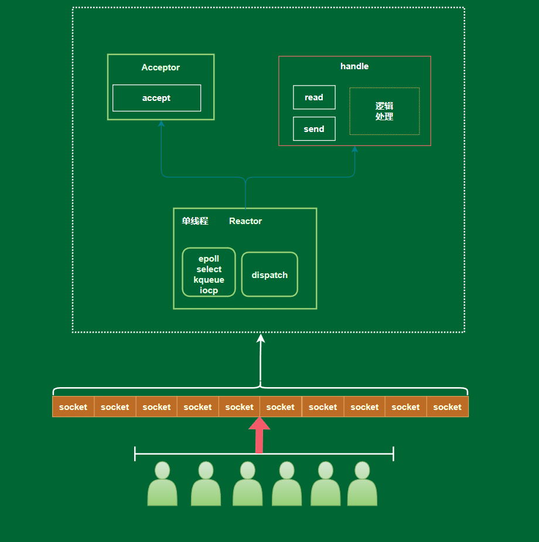

代表作：redis 内存数据库

注意：`redis 6.0 以后是多线程`

## 单reactor 多进程模型

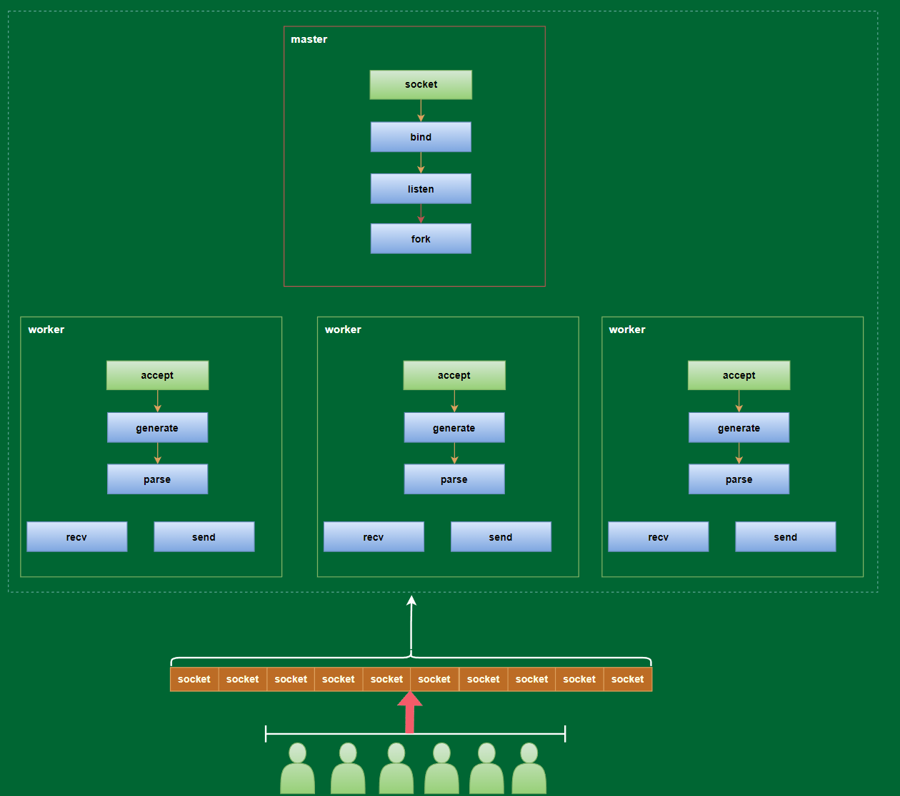

代表：nginx

## 单reactor模型 + 任务队列 + 线程池

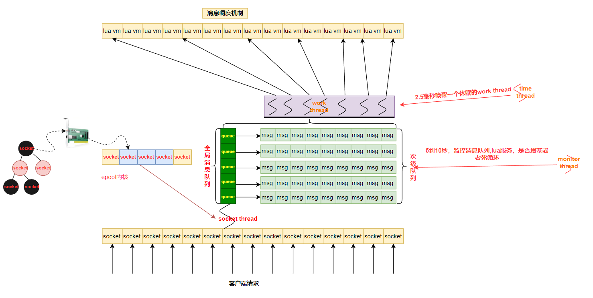

代表作:skynet

## 主从 reactor

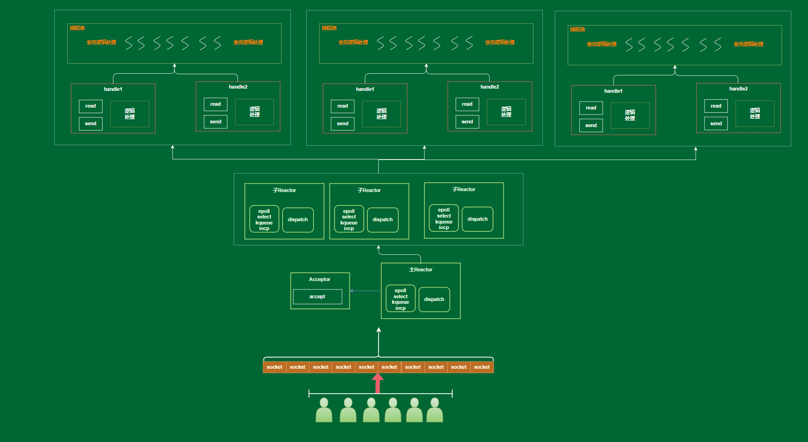

代表作：netty

## 多reactor + 多线程

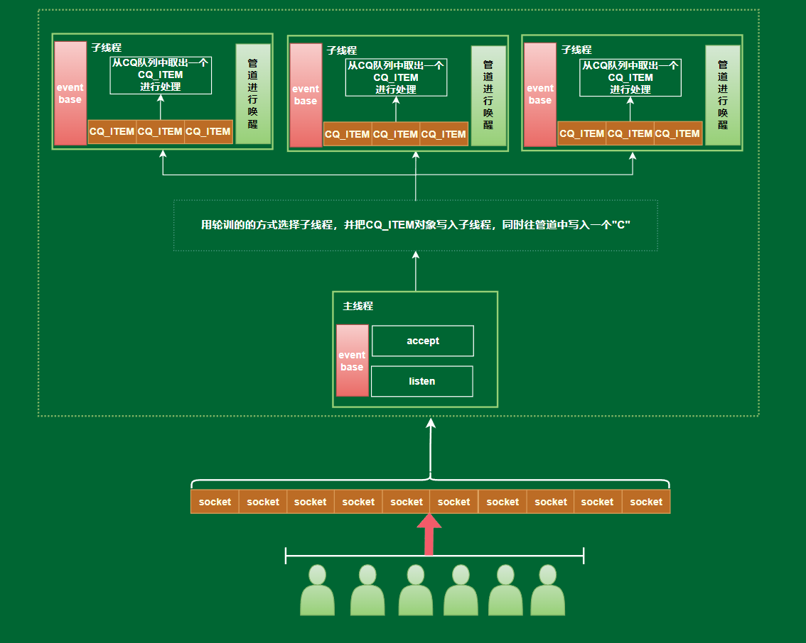

代表作：memcache

## 多reactor + 多线程 +协程池

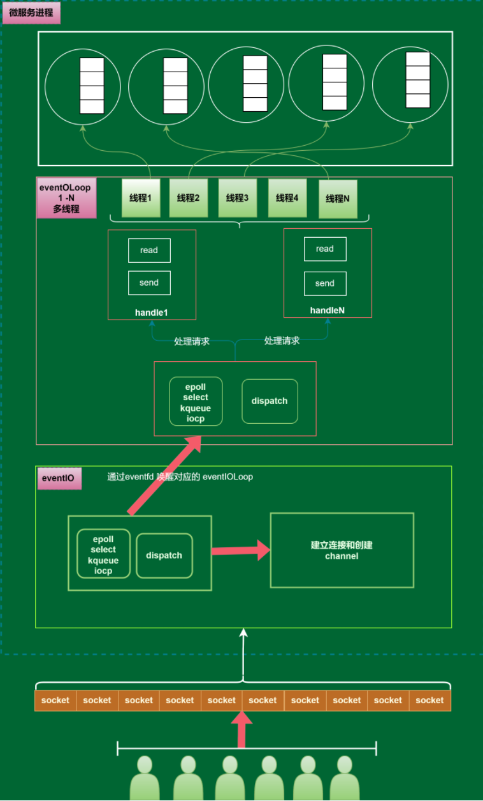

